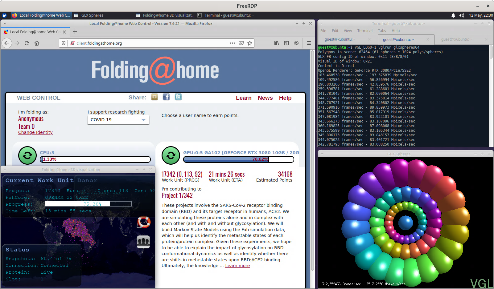

# Xubuntu on Docker

A Docker image based on Ubuntu 24.04 with the Xfce desktop environment,
[xrdp](https://github.com/neutrinolabs/xrdp),
[xrdp PulseAudio module](https://github.com/neutrinolabs/pulseaudio-module-xrdp) and
[VirtualGL](https://github.com/VirtualGL/virtualgl).



## Start an instance

### Docker CLI

```sh
docker run \
  --name xubuntu \
  --detach \
  --shm-size 2g \
  --publish 3322:3322/tcp \
  --publish 3389:3389/tcp \
  --device /dev/dri:/dev/dri \
  docker.io/hectorm/xubuntu:latest
```

### Docker Compose

```yaml
services:
  xubuntu:
    image: 'docker.io/hectorm/xubuntu:latest'
    shm_size: '2gb'
    ports:
      - '3322:3322/tcp'
      - '3389:3389/tcp'
    devices:
      - '/dev/dri:/dev/dri'
```

> You will be able to connect to the container via SSH through 3322/TCP port and RDP through 3389/TCP port.

> **Important:** some software (like Firefox) need the shared memory to be increased, if you
encounter any problem related to this you may use the `--shm-size` option.

## Environment variables

* `UNPRIVILEGED_USER_UID`: unprivileged user UID (`1000` by default).
* `UNPRIVILEGED_USER_GID`: unprivileged user GID (`1000` by default).
* `UNPRIVILEGED_USER_NAME`: unprivileged user name (`user` by default).
* `UNPRIVILEGED_USER_PASSWORD`: unprivileged user password (`password` by default).
* `UNPRIVILEGED_USER_GROUPS`: comma-separated list of additional GIDs for the unprivileged user (none by default).
* `UNPRIVILEGED_USER_SHELL`: unprivileged user shell (`/bin/bash` by default).
* `SERVICE_XRDP_BOOTSTRAP_ENABLED`: enable xrdp bootstrap service, initialises user session on startup (`false` by default).
* `SERVICE_XORG_HEADLESS_ENABLED`: enable headless X server service (`false` by default).

## License

See the [license](LICENSE.md) file.
